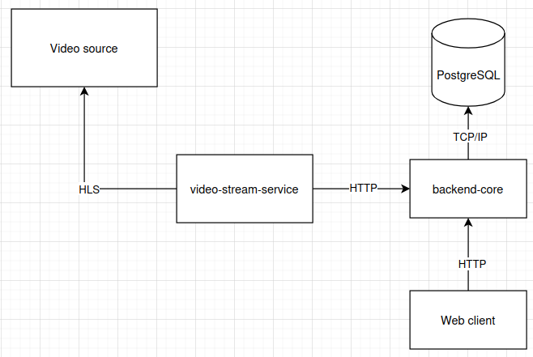

# Проект "Поток"
### Репозиторий команды SlivkiAI для конкурса РАИИ 2025
Видеопоток анализируется данные с камер Ульяновска https://ul.camera/map

### Для локального развертывания проекта необходимо:
1) Установить docker. Найти инструкцию по установке и скачать можно по данной ссылке https://www.docker.com/products/docker-desktop/
2) В корневой директории прописать команду
```commandline
docker compose up --build 
```
3) После успешной сборки проекта будут доступны следующие ресурсы:
- Клиентская часть по адресу `http://localhost:5173`
- Сваггер сервиса flowdetect `http://localhost:8080/swagger-ui/index.html`
- Размеченные кадры видеопотока будут находиться в директории `/video-stream-service/frames`
4) Для обучения модели использовался jupyter notebook из директории `ai-core/flow-detecting_learn_final.ipynb`
5) Размеченный датасет для обучения доступен по ссылке `https://drive.google.com/drive/folders/1CBZvUY2jbBxIRr0cQE2EzCtsHaqVtFPd`
6) Обученная модель находится в корне проекта `best.pt`

### Схема компонентов сервиса
